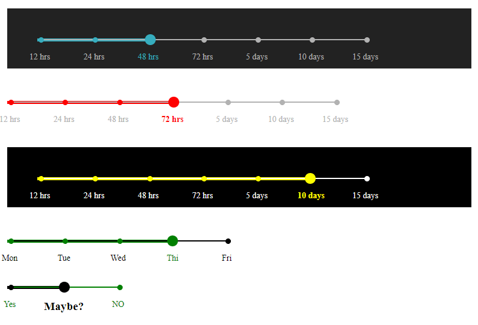

# range-slider-customizable

This repository contains a demonstration of one method for creating a *range slider*. The code (*HTML, CSS, JavaScript/jQuery*) is based upon code I found in [CodePen](<https://codepen.io/trevanhetzel/pen/rOVrGK>).

The unique characteristic of this range slider is that it has fixed *stops* along the track of the range. For my application I needed that instead of a smooth moving slider. The application required that each *stop* provided a unique value.

**NOTE:** The Edge browser **will not work**. I'm not sure if it's a problem with the CSS or Edge. My guess it's a little of both. If I can get it working in Edge I'll post an update.

## At first

The CodePen demonstration *worked* but it was only good as a *proof of concept*. It showed the the basics of how a range slider with stops would work. The author obviously spent time on it, the CSS alone is little tricky.

So my first step was to get the code out of CodePen and into an HTML file that I could edit and debug.

## Next Step(s)

The next step for me was to determine if there were any shortcomings in the original code, and if they were *fixable*. 

Here is what I found:

* The original code would only allow for one instance of the slider. It was hard-coded to access HTML elements by their CSS classes. 
    * The fix: Complete overhaul of how elements were selected in code, added tag id's and named them so that the tags of child elements can be programmatically assembled as needed.
* Change the color(s) - This was also hard-coded. And not convenient to alter or allow for multiple slider instances.
    * The fix: Fixed this by using CSS variables and creating CSS classes targeted via the tag ID to alter the color.
* Change the quantity of stops - The original code was locked in at 7 stops including the end stops. A hard-coded calculation was based upon the use of only 7 stops.
    * The fix: Rewrote the calculation so that it would utilize the `max` attribute of the `<input>` element to determine the percentage of space taken up by each segment.

## The Results

<p align="center">
  
</p>

### Code

**HTML:** This is an example of just one slider.
```
    <div id="slide-test-1">
        <div id="range-1" class="range">
            <input id="input-range-1" type="range" min="1" max="7" steps="1" value="1">
        </div>
        <ul id="labels-range-1" class="range-labels">
            <li data-stop=12 class="active selected">12 hrs</li>
            <li data-stop=24>24 hrs</li>
            <li data-stop=48>48 hrs</li>
            <li data-stop=72>72 hrs</li>
            <li data-stop=120>5 days</li>
            <li data-stop=240>10 days</li>
            <li data-stop=360>15 days</li>
        </ul>
    </div>
```

**JavaScript:**

*index.html*: This is the code that runs when the page is loaded and sets up the slider(s).
```
    <script type="text/javascript" src="./slider.js"></script>
    <script type="text/javascript">
        function autorun() {
            slider('range-1');
        };
        if (document.addEventListener) document.addEventListener("DOMContentLoaded", autorun, false);
        else if (document.attachEvent) document.attachEvent("onreadystatechange", autorun);
        else window.onload = autorun;
    </script>
```

*slider.js*: This is it, about 50 lines of code. 
```
// Create a slider, pass in the ID of the <div>
// containing the <input>
function slider(s_id) {

    // assemble the tag id's we'll need later
    var range       = '#'+s_id;
    var inputRange  = '#input-'+s_id;
    var labelsRange = '#labels-'+s_id;

    var getTrackStyle = function (elem) {  
        var curVal = elem.value;
        // The number of stops determines the multiplier
        // below. For example, if there are 7 stops in
        // total then there will be 6 blank spaces between
        // them. So if 100% is the total length then:
        //      100 / 6 = 16.666666667% 
        var step = 100 / ($(inputRange).attr('max') - 1);
        // 
        var seltrack = (curVal - 1) * step;
        
        // Set active label
        $(labelsRange+' li').removeClass('active selected');
        var curLabel = $(labelsRange).find('li:nth-child(' + curVal + ')');
        curLabel.addClass('active selected');
        curLabel.prevAll().addClass('selected');

        console.log('getTrackStyle - '+labelsRange+' = '+curLabel.data('stop'));

        // Change background gradient.....
        // provide the necessary styling to create a 
        // colored line to the left of the selected stop.
        // and use the background color of the parent element to
        // set the background behind the unselected track.
        var style = range+' {background: linear-gradient(to right, var(--slider-active-color) 0%, var(--slider-active-color) ' + seltrack + '%, '+$(range).parent().css('background-color')+' ' + seltrack + '%, '+$(range).parent().css('background-color')+' 100%);}\n';

// NOTE: This breaks the sliders, the unselected line will disappear
// when a stop is selected. Not sure why, requires further investigation.
//
//        var prefs = ['webkit-slider-runnable-track', 'moz-range-track', 'ms-track'];
//        for (var i = 0; i < prefs.length; i++) {
//            style += range+' input::-' + prefs[i] + ' {background: linear-gradient(to right, var(--slider-active-color) 0%, var(--slider-active-color) ' + seltrack + '%, '+$(range).parent().css('background-color')+' ' + seltrack + '%, '+$(range).parent().css('background-color')+' 100%);}\n';
//        }

        console.log('getTrackStyle - style = ['+style+']');
        return style;
    };

    var sheet = document.createElement('style');
    document.body.appendChild(sheet);
    
    // when a stop is selected apply the necessary
    // styling and get the usable value of the stop.
    $(inputRange).on('input', function () {
        sheet.textContent = getTrackStyle(this);
    });

    // Change input value on label click
    $(labelsRange+' li').on('click', function () {
        var index = $(this).index();
        $(inputRange).val(index + 1).trigger('input');
    });
};
```

## Running the Code

Open `index.html` directly in your browser. And have fun!

## To Do

* Fix the track that is selected: The track will show the first line over the top of the colored highlight. It should not be visible or hidden behind the highlight.
* Try to get other shapes to indicate stops, squares, triangles, etc. And/or Font Awesome icons would be nice touch.
* See if it's possible to change the color of the selected track as stops are chosen.


